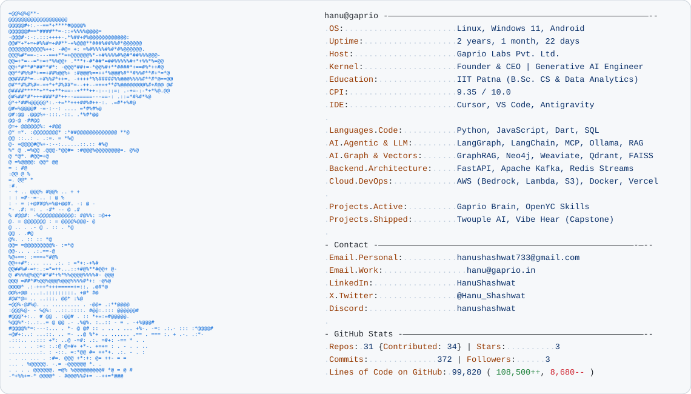

<a href="https://github.com/HanuShashwat/HanuShashwat">
  <picture>
    <source media="(prefers-color-scheme: dark)" srcset="dark_mode.svg">
    
  </picture>
</a>

 

---

### 👨‍💻 About Me

- 🚀 **Founder & CEO** at **[Gaprio Labs](mailto:hanu@gaprio.in)** — Architecting proactive AI agent orchestration layers with human-in-the-loop oversight to turn high-level team collaboration into autonomous execution.
- 🧠 **Generative AI Engineer** focused on LLM agent swarms, production RAG & GraphRAG pipelines, knowledge graphs, and cloud-native microservice architectures.
- 🛠️ Hands-on across the complete AI lifecycle: from dual-write canonical knowledge architectures and real-time collaboration engines to cloud deployment, low-latency streaming, and monitoring.

---

### 🚀 Featured Work & Architecture

| Project | Highlights & Tech Stack |
| :--- | :--- |
| **[Gaprio Brain](https://github.com/HanuShashwat)** | Core multi-tenant knowledge layer with **Neo4j + Weaviate** dual-write pattern, Canonical Knowledge Fact model, 6-repo microservices architecture, and **Redis Streams** event bus. |
| **[OpenYC Skills](https://github.com/HanuShashwat)** | Multi-stage pipeline scraping, clustering, and synthesizing structured "skill files" from YC content with export targets for **Model Context Protocol (MCP)**, OpenAI, and Hermes. |
| **[Twouple AI](https://github.com/HanuShashwat)** | AI-first Vedic astrology & relationship guidance platform featuring Swiss Ephemeris calculations, **Qdrant vector search**, RAG, real-time chat via **Socket.io**, and DPDP Act compliance. |
| **[Vibe Hear](https://github.com/HanuShashwat)** | Capstone mobile accessibility app converting spoken language into distinct vibratory tactile patterns, featuring on-device NLP, offline keyword detection, and live transcription. |

---

### 🧰 Technical Arsenal

- **Languages**: `Python` • `JavaScript` • `Dart` • `SQL` • `C++`
- **AI & Agentic Systems**: `LangGraph` • `LangChain` • `Model Context Protocol (MCP)` • `Ollama` • `GraphRAG` • `RAG` • `Hugging Face Transformers`
- **Databases & Vector Stores**: `Neo4j` • `Weaviate` • `Qdrant` • `Redis / Redis Streams` • `PostgreSQL` • `MySQL` • `FAISS` • `ChromaDB`
- **Backend & Event-Driven**: `FastAPI` • `Apache Kafka` • `Microservices` • `Docker` • `Uvicorn`
- **Cloud & DevOps**: `AWS (Bedrock, Lambda, S3, EC2)` • `Cloudflare` • `Vercel` • `GitHub Actions`
- **Frontend & Mobile**: `Next.js` • `Flutter` • `Streamlit`

---

  Configured with dynamic GitHub Actions telemetry inspired by <a href="https://github.com/Andrew6rant/Andrew6rant">Andrew6rant</a>. Automatically refreshed daily.

